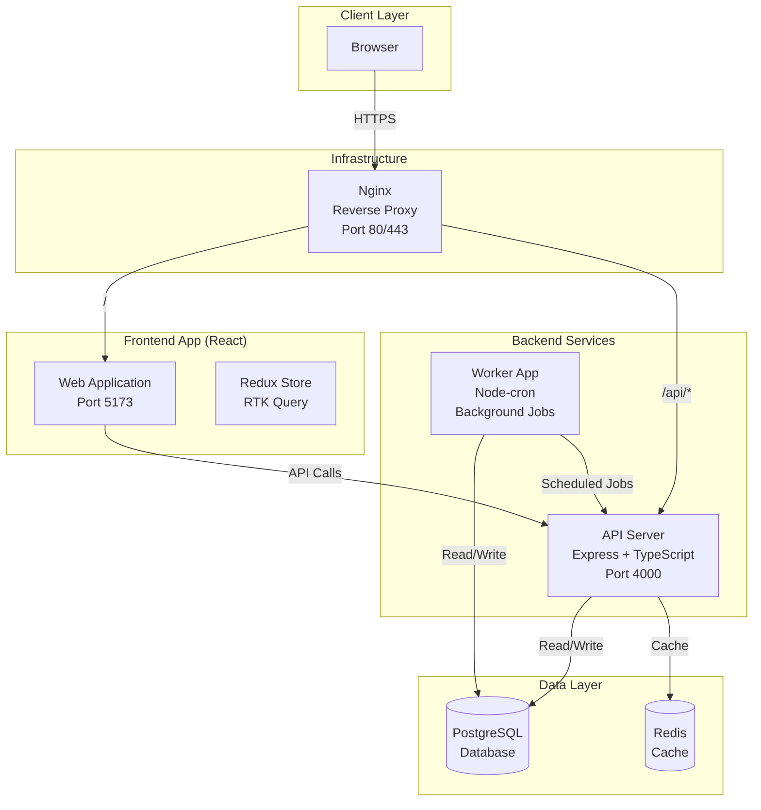
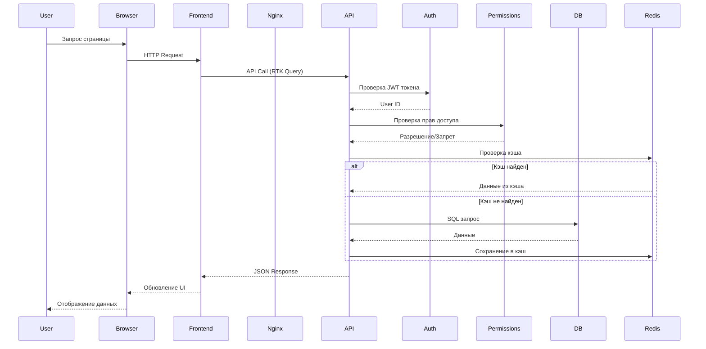
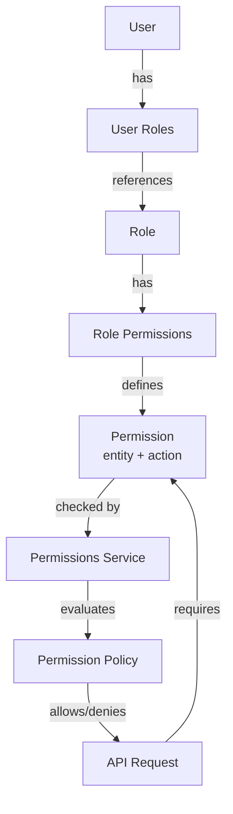
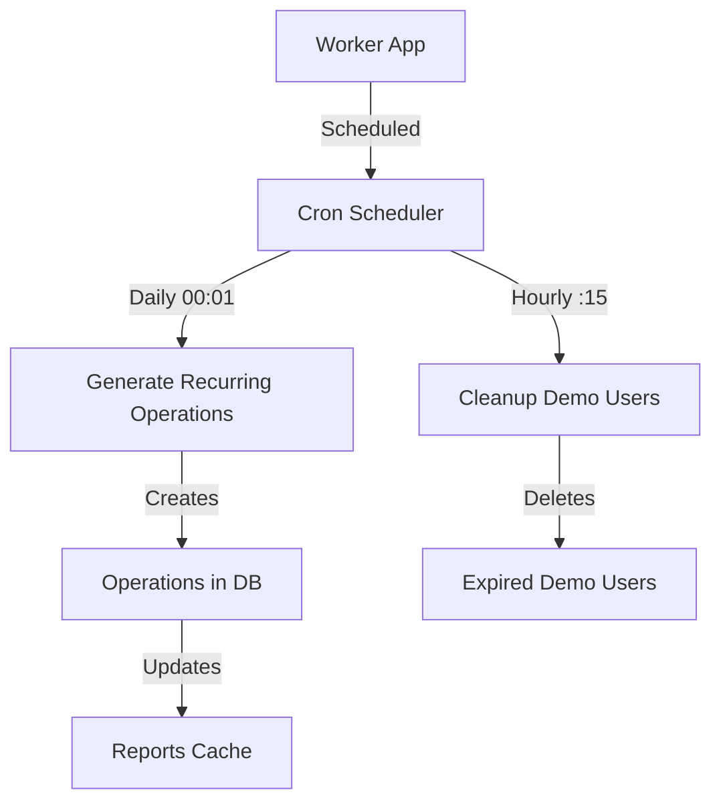

# ARCHITECTURE

## Общая архитектура системы



## Поток данных запроса



## Структура модулей Backend

```mermaid
graph LR
    subgraph API["API Server"]
        Auth[Auth Module]
        Users[Users Module]
        Companies[Companies Module]
        Catalogs[Catalogs Module]
        Operations[Operations Module]
        Budgets[Budgets Module]
        Plans[Plans Module]
        Reports[Reports Module]
        Roles[Roles Module]
        Audit[Audit Module]
        Imports[Imports Module]
        Subscription[Subscription Module]
        Demo[Demo Module]
    end

    subgraph Middleware["Middleware"]
        AuthMW[Authentication]
        TenantMW[Tenant Extraction]
        PermissionsMW[Permissions Check]
        ErrorMW[Error Handler]
    end

    subgraph Services["Services"]
        Mail[Mail Service]
        Token[Token Service]
    end

    API --> Middleware
    Middleware --> Services
```



## Система прав доступа (RBAC)



## Worker App - Фоновые задачи



## Структура папок

```
/ (repo root)
├─ package.json                # workspaces + общие скрипты
├─ pnpm-workspace.yaml         # или yarn/npm workspaces
├─ .env.example                # список переменных окружения
├─ docs/
│  ├─ ARCHITECTURE.md
│  ├─ API.md
│  ├─ DB_SCHEMA.sql
│  └─ DECISIONS.md
├─ ops/                        # инфраструктура
│  ├─ docker/
│  │  ├─ api.Dockerfile
│  │  ├─ web.Dockerfile
│  │  ├─ worker.Dockerfile
│  │  └─ docker-compose.yml    # локалка: api+db+redis+pgadmin
│  ├─ nginx/                   # конфиг реверс-прокси
│  │  ├─ nginx.conf
│  │  └─ ssl/                  # SSL сертификаты (опционально)
│  └─ k8s/                     # манифесты (на будущее)
├─ scripts/                    # утилиты: миграции, сиды, индексы, backup/restore
│  ├─ db-reset.ts
│  ├─ seed-dev.ts
│  ├─ create-indexes.sql
│  ├─ backup-db.ts             # экспорт БД в SQL файл
│  └─ restore-db.ts            # импорт БД из SQL файла
├─ packages/
│  └─ shared/
│     ├─ src/
│     │  ├─ types/             # DTO, enum, общие интерфейсы
│     │  │  ├─ auth.ts
│     │  │  ├─ catalogs.ts
│     │  │  ├─ operations.ts
│     │  │  ├─ reports.ts
│     │  │  └─ notifications.ts
│     │  ├─ constants/
│     │  │  ├─ config.ts
│     │  │  └─ enums.ts
│     │  ├─ schemas/
│     │  │  └─ notifications.ts
│     │  └─ index.ts
│     └─ package.json
└─ apps/
   ├─ web/                     # Frontend: React + TS + Vite + Tailwind + Redux Toolkit
   │  ├─ index.html
   │  ├─ vite.config.ts
   │  ├─ jest.config.js         # конфиг Jest
   │  ├─ playwright.config.ts   # конфиг Playwright для E2E тестов
   │  ├─ e2e/                   # E2E тесты (Playwright)
   │  └─ src/
   │     ├─ app/               # init приложения: провайдеры, роутер
   │     │  ├─ router.tsx
   │     │  └─ providers.tsx
   │     ├─ pages/             # роутовые экраны
   │     │  ├─ DashboardPage/
   │     │  ├─ OperationsPage/
   │     │  ├─ PlansPage/
   │     │  └─ ReportsPage/
     │     ├─ features/          # самостоятельные фичи (формы/виджеты)
     │     │  ├─ operation-form/
     │     │  └─ plan-editor/
   │     ├─ entities/          # доменные сущности UI-слоя
   │     │  ├─ article/
   │     │  ├─ account/
   │     │  ├─ operation/
   │     │  └─ plan/
   │     ├─ widgets/           # крупные блоки: таблицы/дашборды
   │     │  ├─ CashflowTable/
   │     │  └─ PlanVsFactChart/
   │     ├─ store/            # Redux Toolkit: store, slices, api
   │     │  ├─ store.ts
   │     │  ├─ slices/        # auth, catalogs, operations, plans, reports
   │     │  └─ api/           # RTK Query endpoints
   │     └─ shared/
   │        ├─ api/            # axios-инстанс, rest-хелперы, hooks
   │        ├─ ui/             # базовые UI-компоненты на Tailwind
   │        ├─ lib/            # date/money/utils
   │        └─ config/         # env-маппинг, константы
   ├─ api/                     # Backend: Node + Express + TS + Prisma + PG
   │  ├─ tsconfig.json
   │  ├─ jest.config.js         # конфиг Jest для unit/integration тестов
   │  ├─ prisma/
   │  │  ├─ schema.prisma
   │  │  └─ migrations/
   │  └─ src/
   │     ├─ server.ts          # запуск http
   │     ├─ app.ts             # express app + маршруты + middlewares
   │     ├─ config/
   │     │  ├─ env.ts          # чтение ENV (валидация), конфиги
   │     │  ├─ db.ts           # инициализация Prisma Client
   │     │  ├─ redis.ts        # инициализация Redis Client
   │     │  ├─ swagger.ts      # конфигурация OpenAPI/Swagger
   │     │  └─ logger.ts
   │     ├─ db/
   │     │  ├─ models/         # Prisma модели (автогенерация)
   │     │  └─ seeders/
     │     ├─ middlewares/
     │     │  ├─ auth.ts         # JWT проверка
     │     │  ├─ tenant.ts       # извлечение companyId
     │     │  ├─ permissions.ts  # проверка прав доступа
     │     │  ├─ error.ts        # единый обработчик ошибок
     │     │  ├─ subscription.guard.ts # проверка лимитов подписки
     │     │  └─ user-limit.guard.ts   # проверка лимита пользователей
     │     ├─ modules/           # по доменным модулям
     │     │  ├─ auth/           # аутентификация и авторизация
     │     │  │  ├─ auth.service.ts
     │     │  │  ├─ auth.controller.ts
     │     │  │  ├─ auth.routes.ts
     │     │  │  ├─ password-reset.service.ts
     │     │  │  └─ migrate-existing-users.ts
     │     │  ├─ companies/      # управление компаниями
     │     │  │  ├─ companies.service.ts
     │     │  │  ├─ companies.controller.ts
     │     │  │  └─ companies.routes.ts
     │     │  ├─ users/          # управление пользователями
     │     │  │  ├─ users.service.ts
     │     │  │  ├─ users.controller.ts
     │     │  │  └─ users.routes.ts
     │     │  ├─ catalogs/       # справочники
     │     │  │  ├─ articles/   # статьи доходов/расходов
     │     │  │  ├─ accounts/   # счета
     │     │  │  ├─ departments/ # подразделения
     │     │  │  ├─ counterparties/ # контрагенты
     │     │  │  └─ deals/      # сделки
     │     │  ├─ operations/    # финансовые операции
     │     │  │  ├─ operations.service.ts
     │     │  │  ├─ operations.controller.ts
     │     │  │  └─ operations.routes.ts
     │     │  ├─ budgets/       # управление бюджетами
     │     │  │  ├─ budgets.service.ts
     │     │  │  ├─ budgets.controller.ts
     │     │  │  └─ budgets.routes.ts
     │     │  ├─ plans/         # планирование (PlanItem)
     │     │  │  ├─ plans.service.ts
     │     │  │  ├─ plans.controller.ts
     │     │  │  └─ plans.routes.ts
     │     │  ├─ reports/       # отчеты
     │     │  │  ├─ dashboard/  # дашборд
     │     │  │  ├─ cashflow/   # ОДДС
     │     │  │  ├─ bdds/       # БДДС
     │     │  │  ├─ planfact/   # план-факт
     │     │  │  ├─ cache/      # управление кэшем
     │     │  │  └─ utils/      # утилиты (кэширование, даты)
     │     │  ├─ roles/         # система ролей и прав доступа
     │     │  │  ├─ roles.service.ts
     │     │  │  ├─ roles.controller.ts
     │     │  │  ├─ roles.routes.ts
     │     │  │  ├─ permissions.service.ts
     │     │  │  ├─ config/     # конфигурация сущностей и действий
     │     │  │  └─ policy/     # политики доступа
     │     │  ├─ audit/         # журнал аудита
     │     │  │  ├─ audit.service.ts
     │     │  │  ├─ audit.controller.ts
     │     │  │  └─ audit.routes.ts
     │     │  ├─ demo/          # демо-система
     │     │  │  ├─ demo.service.ts
     │     │  │  ├─ demo-catalogs.service.ts
     │     │  │  ├─ demo-data-generator.service.ts
     │     │  │  ├─ demo.controller.ts
     │     │  │  └─ demo.routes.ts
     │     │  ├─ imports/       # импорт банковских выписок
     │     │  │  ├─ imports.service.ts
     │     │  │  ├─ imports.controller.ts
     │     │  │  ├─ imports.routes.ts
     │     │  │  ├─ parsers/    # парсеры выписок (ClientBank Exchange)
     │     │  │  ├─ services/   # сервисы (сопоставление, дубликаты, правила)
     │     │  │  └─ utils/      # утилиты (batch processing)
     │     │  ├─ subscription/  # система подписок
     │     │  │  ├─ subscription.service.ts
     │     │  │  ├─ subscription.controller.ts
     │     │  │  ├─ subscription.routes.ts
     │     │  │  └─ promo-code.service.ts
     │     │  ├─ support/       # поддержка (Telegram интеграция)
     │     │  │  ├─ support.service.ts
     │     │  │  ├─ support.controller.ts
     │     │  │  └─ support.routes.ts
     │     │  └─ currency/      # конвертация валют
     │     │     └─ currency.service.ts
     │     ├─ services/          # общие сервисы
     │     │  └─ mail/           # отправка email (верификация, сброс пароля)
     │     │     ├─ mail.service.ts
     │     │     ├─ token.service.ts
     │     │     ├─ rate-limit.middleware.ts
     │     │     └─ templates/   # HTML шаблоны писем
     │     ├─ utils/             # утилиты
     │     │  ├─ jwt.ts          # работа с JWT токенами
     │     │  ├─ hash.ts         # хеширование паролей
     │     │  ├─ validation.ts   # валидация данных
     │     │  ├─ currency-converter.ts # конвертация валют
     │     │  └─ subscription.ts # утилиты подписок
     │     └─ routes.ts          # сборка всех *.routes (в app.ts)
   └─ worker/                  # фоновые задачи/cron
      ├─ jest.config.js         # конфиг Jest для тестов воркера
      ├─ src/
      │  ├─ index.ts           # загрузка джобов/планировщика
      │  ├─ jobs/
      │  │  ├─ operations.generate.recurring.ts # генерация периодических операций
      │  │  └─ cleanup-demo-users.job.ts # очистка старых демо-пользователей
      │  └─ config/
      │     ├─ env.ts
      │     ├─ logger.ts
      │     └─ prisma.ts
      └─ package.json
```

## Общая схема

- **Frontend (SPA)**: React + TS + Vite + Tailwind + Axios + React Router + Redux Toolkit (управление состоянием).
- **Backend (REST API)**: Node + Express + TS + Prisma.
- **DB**: PostgreSQL (одна БД, multi-tenant через companyId в каждой таблице; индексы по companyId + дате).
- **Cache**: Redis (кэширование отчётов и тяжёлых вычислений).
- **Reverse Proxy**: Nginx (маршрутизация запросов между frontend/backend, SSL termination).
- **Auth**: JWT (access+refresh). Пароли через bcryptjs (pure JavaScript).
- **API Documentation**: автоматическая генерация OpenAPI через swagger-jsdoc + swagger-ui-express.
- **Testing**: Jest (unit/integration тесты), Playwright (E2E тесты).
- **Монорепо**: /apps/web, /apps/api, /apps/worker, /packages/shared (типы/enum-ы).
- **Фоновые задачи** (Worker App):
  - Генерация периодических операций (ежедневно в 00:01) — `operations.generate.recurring.ts`.
  - Очистка старых демо-пользователей (ежечасно в :15) — `cleanup-demo-users.job.ts`.
  - «Разворачивание» планов в календарную сетку при вычислении отчётов на лету.

## Модули backend

- **auth** - Аутентификация и авторизация (JWT, refresh tokens, email verification, password reset).
- **companies** - Управление компаниями (настройки, валюта, UI preferences).
- **users** - Управление пользователями (профиль, настройки, смена email/пароля, приглашения).
- **catalogs** - Справочники:
  - **articles** - Статьи доходов/расходов (иерархическая структура).
  - **accounts** - Банковские счета и касса.
  - **departments** - Подразделения компании.
  - **counterparties** - Контрагенты (клиенты, поставщики, сотрудники, государство).
  - **deals** - Сделки и проекты.
- **operations** - Финансовые операции (доходы, расходы, переводы, периодические операции).
- **budgets** - Управление бюджетами (создание, архивирование, группировка планов).
- **plans** - Плановые записи БДДС (PlanItem с поддержкой budgetId и периодичности).
- **reports** - Отчеты:
  - **dashboard** - Дашборд с KPI и графиками.
  - **cashflow** - ОДДС (операционный денежный поток).
  - **bdds** - БДДС (бюджет движения денежных средств).
  - **planfact** - План-факт анализ.
  - **cache** - Управление кэшем отчетов.
- **roles** - Система ролей и прав доступа (RBAC на уровне сущностей и действий).
- **audit** - Журнал аудита (логирование всех действий пользователей).
- **demo** - Демо-система (автоматическое создание тестовых данных).
- **imports** - Импорт банковских выписок:
  - Парсинг выписок (ClientBank Exchange формат).
  - Автоматическое сопоставление со справочниками.
  - Правила маппинга (mapping rules).
  - Обнаружение дубликатов.
- **subscription** - Система подписок и тарифных планов (промокоды, лимиты).
- **support** - Интеграция с поддержкой (Telegram).
- **currency** - Конвертация валют.

## Хранилище и индексация

**Тяжёлые выборки**:

- operations индекс: (companyId, operationDate), (companyId, articleId, operationDate).
- plans индекс: (companyId, startDate, repeat), (companyId, budgetId, startDate).
- budgets индекс: (companyId, status).
- articles индекс: (companyId, parentId).

Денормализации не делаем в MVP. При необходимости — materialized view для ОДДС.

## Отчёты (генерация)

- **ОДДС (факт)**: группировка по activity → type → article → месяц; учёт transfer только на остатках.
- **БДДС (план)**: генерация помесячных сумм из PlanItem (repeat).
- **План/факт**: объединение по ключам (месяц, articleId, …).

### Кэширование отчётов (Redis)

Тяжёлые отчёты (ОДДС, план/факт за большие периоды) кэшируются в Redis:

- **Ключ**: `report:{companyId}:{reportType}:{hash(params)}`.
- **TTL**: 5-15 минут (настраивается, по умолчанию 300 секунд).
- **Инвалидация**: при создании/обновлении операций или планов сбрасываем кэш для соответствующей компании.
- **Формат**: JSON (сериализованный результат отчёта).
- **Реализация**: `apps/api/src/modules/reports/utils/cache.ts`

Конфигурация Redis:

- Хост/порт/пароль через переменные окружения (`REDIS_URL`).
- Для локальной разработки — Redis в docker-compose.
- Подключение: `apps/api/src/config/redis.ts` с retry стратегией.

### Политика кэширования данных для графиков

- Backend: данные для дашборда и графиков (включая остатки по счетам) кэшируются в Redis на 5 минут через общий утилитный модуль (`apps/api/src/modules/reports/utils/cache.ts`). Ключ: `report:{companyId}:{reportType}:{hash(params)}`. Обязательно включайте все параметры запроса (диапазон дат, формат периода, фильтры) в ключ через `generateCacheKey`.
- Frontend: RTK Query кэширует ответы в памяти на время жизни компонента и короткое время после размонтирования (без персистентности). HTTP Cache-Control/ETag для этих эндпоинтов не используется.
- Инвалидация: при изменении операций/планов сбрасывайте соответствующие ключи компании через `invalidateReportCache(companyId)`.
- Для новых фич графиков: используйте серверный кэш из `utils/cache.ts`, задавайте подходящий TTL (по умолчанию 300s), учитывайте все параметры запроса в ключе и не полагайтесь на браузерный кэш.

## Nginx Reverse Proxy

Nginx используется как reverse proxy для маршрутизации запросов между frontend и backend.

### Основная конфигурация

Файл: `ops/nginx/nginx.conf`

**Функции:**

1. **Маршрутизация**:
   - `/` → frontend (web) на порту 3000
   - `/api/*` → backend (api) на порту 4000
   - `/api-docs` → Swagger UI документация

2. **SSL Termination**:
   - Обработка HTTPS соединений
   - Сертификаты в `ops/nginx/ssl/` (Let's Encrypt или самоподписанные)
   - Редирект HTTP → HTTPS в production

3. **Load Balancing** (опционально):
   - Балансировка между несколькими инстансами API
   - Health checks для backend сервисов

4. **Кэширование**:
   - Статические файлы frontend (cache-control headers)
   - Сжатие gzip для HTML/CSS/JS

5. **Security Headers**:
   - X-Frame-Options, X-Content-Type-Options
   - CORS настройки для API

### Пример конфигурации

```nginx
upstream api {
    server api:4000;
}

upstream web {
    server web:5173;
}

server {
    listen 80;
    server_name example.com;

    # Редирект на HTTPS
    return 301 https://$server_name$request_uri;
}

server {
    listen 443 ssl http2;
    server_name example.com;

    ssl_certificate /etc/nginx/ssl/fullchain.pem;
    ssl_certificate_key /etc/nginx/ssl/privkey.pem;

    # API endpoints
    location /api {
        proxy_pass http://api:4000;
        proxy_set_header Host $host;
        proxy_set_header X-Real-IP $remote_addr;
        proxy_set_header X-Forwarded-For $proxy_add_x_forwarded_for;
        proxy_set_header X-Forwarded-Proto $scheme;
    }

    # Swagger UI
    location /api-docs {
        proxy_pass http://api:4000/api-docs;
    }

    # Frontend
    location / {
        proxy_pass http://web:5173;
        proxy_set_header Host $host;
        proxy_set_header X-Real-IP $remote_addr;
    }
}
```

### Деплой

- В docker-compose: Nginx как отдельный сервис, связанный с web и api.
- В production: Nginx запускается первым и слушает порты 80/443.
- Автоматическая перезагрузка конфигурации при изменениях: `nginx -s reload`.

## Worker App

Отдельное приложение для выполнения фоновых задач и cron-задач.

### Основные возможности

- **Генерация периодических операций**: Автоматическое создание операций на основе шаблонов с периодичностью
- **Очистка демо-пользователей**: Автоматическое удаление старых демо-аккаунтов
- **Планировщик задач**: Использует `node-cron` для запуска задач по расписанию
- **Graceful shutdown**: Корректное завершение работы с отключением от БД

### Структура

```
apps/worker/src/
├── index.ts              # Точка входа, настройка cron задач
├── jobs/
│   ├── operations.generate.recurring.ts   # Генерация периодических операций
│   └── cleanup-demo-users.job.ts          # Очистка старых демо-пользователей
└── config/
    ├── env.ts            # Переменные окружения
    ├── logger.ts         # Winston логгер
    └── prisma.ts         # Prisma клиент
```

### Расписание

- **Периодические операции**: `1 0 * * *` (ежедневно в 00:01)
- **Очистка демо-пользователей**: `15 * * * *` (ежечасно в :15)
- **Часовой пояс**: `Europe/Moscow`

### Зависимости

- `@prisma/client` - доступ к базе данных
- `node-cron` - планировщик задач
- `winston` - логирование
- `dotenv` - переменные окружения

### Запуск

```bash
cd apps/worker
pnpm dev    # режим разработки с hot reload
pnpm build  # сборка для production
pnpm start  # запуск production версии
```

## Статус реализации

### ✅ Полностью реализовано

- **API**: Все основные endpoints работают
- **Demo System**: Полная система демо-данных с автоматическим созданием тестовых данных
- **Reports API**: Все типы отчетов реализованы в backend (Dashboard, Cashflow/ОДДС, BDDS, Plan-Fact)
- **Worker App**: Автоматическая генерация периодических операций и очистка демо-пользователей
- **Caching**: Redis кэширование для отчетов с автоматической инвалидацией
- **Multi-tenancy**: Полная изоляция данных по companyId на всех уровнях
- **Frontend**: Все основные страницы и функционал
- **Notifications System**: Полная система уведомлений с Redux store и UI компонентами
- **UI Customization**: Настройка иконок навигации и тем компании
- **Theme System**: Поддержка светлой/темной темы с автоматическим определением
- **Responsive Design**: Адаптивный дизайн для всех устройств
- **Dashboard Charts**: Полностью реализованные графики с использованием recharts (IncomeExpenseChart, WeeklyFlowChart, AccountBalancesChart)
- **Article Hierarchy UI**: Полностью реализованная иерархия статей с компонентами ArticleTree, ArticleTreeNode, ArticleParentSelect, поддержкой drag-and-drop для изменения родителя, поиском по дереву и двумя режимами отображения (дерево/таблица)
- **Role-Based Access Control (RBAC)**: Полная система ролей и прав доступа
- **Audit Logging**: Система логирования всех действий пользователей
- **Import System**: Полная система импорта банковских выписок с автоматическим сопоставлением
- **Subscription System**: Система подписок и тарифных планов с промокодами
- **Email System**: Верификация email, сброс пароля, смена email адреса
- **Password Management**: Безопасное хранение паролей (bcrypt), сброс через email токены
- **Export System**: Полностью реализованный экспорт данных в Excel (XLSX) и CSV через компонент ExportMenu, используется в CashflowTable, OperationsPage, и всех графиках Dashboard (IncomeExpenseChart, WeeklyFlowChart, AccountBalancesChart)
- **Support Integration**: Интеграция с поддержкой через Telegram бот (отправка сообщений в Telegram группу через API бота)
- **Ozon Integration**: Интеграция с Ozon для автоматической загрузки операций и выплат (UI компонент OzonIntegration, настройка API ключей, выбор статей и счетов)
- **Mapping Rules**: Полная система настройки правил маппинга для импорта банковских выписок (MappingRules компонент, MappingRuleDialog для создания/редактирования правил, типы правил: contains, equals, regex, alias)
- **Recurring Operations**: Полностью реализованная система повторяющихся операций (компонент RecurringOperations для управления шаблонами, автоматическая генерация через Worker job, поддержка различных периодичностей: daily, weekly, monthly, quarterly, semiannual, annual)

### ⚠️ Частично реализовано

- **Soft Delete**: Поля deletedAt есть в схеме для некоторых моделей (Company, User, Account, Department, Role), но не используются в сервисах (выполняется физическое удаление)
- **Swagger Documentation**: Основные endpoints документированы, некоторые каталоги без полной документации

### ❌ Не реализовано

- Нет функций, которые не реализованы (все основные функции реализованы)
